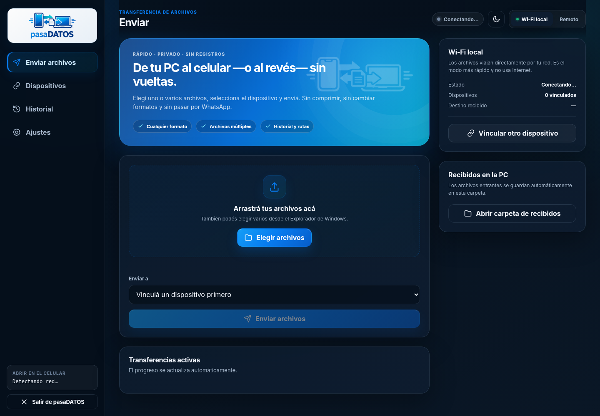
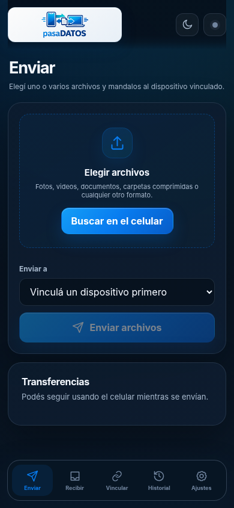

# pasaDATOS

**pasaDATOS** es una aplicación simple para transferir uno o varios archivos entre una computadora y un celular, sin usar WhatsApp, correo ni servicios de almacenamiento como paso intermedio.

Funciona de dos maneras:

- **Wi‑Fi local:** la PC actúa como servidor dentro de la red y los archivos viajan directamente entre dispositivos.
- **Remoto:** ambos dispositivos se conectan a un relay privado desplegable en un VPS y pueden intercambiar archivos desde redes diferentes.

No exige cuenta ni registro. El vínculo se realiza con un código temporal de un solo uso y queda guardado en cada dispositivo.

## Distribuciones compiladas

El repositorio conserva el código fuente, los scripts de build, la documentación y las sumas de integridad. Los binarios compilados no se guardan en el historial Git: podés generarlos con los scripts incluidos o descargarlos desde una publicación de GitHub cuando esté disponible.

| Componente | Archivo | Uso |
|---|---|---|
| Instalador Windows x64 | `scripts/build-release.sh` | Genera la distribución Windows |
| Windows portátil x64 | `scripts/build-release.sh` | Genera la distribución portable |
| Relay Linux x64 | `go build ./cmd/pasadatos` | Genera el servidor remoto |
| App móvil | Integrada en el servidor | Se instala desde Android o iPhone |

## Funciones principales

- Envío de cualquier extensión de archivo.
- Selección múltiple y arrastrar/soltar en Windows.
- Transferencia en streaming, sin cargar el archivo completo en memoria.
- Descargas reanudables mediante rangos HTTP.
- Historial de enviados y recibidos.
- Registro de ruta de origen y ruta de destino en la PC.
- Guardado automático de archivos recibidos en Windows.
- Renombrado seguro cuando ya existe un archivo con el mismo nombre.
- Vinculación sin usuario ni contraseña.
- Código temporal de un solo uso y vencimiento automático.
- Relay autohospedado con Docker, Traefik o Nginx.
- Eliminación automática de archivos temporales del relay.
- Interfaz instalable en Android y iPhone desde la pantalla de inicio.

## Inicio rápido

### 1. Windows

Ejecutá:

```text
pasaDATOS-Setup-Windows-x64.exe
```

El instalador:

1. instala la aplicación en el perfil del usuario;
2. crea accesos directos;
3. configura el inicio con Windows;
4. habilita el puerto `8765/TCP` solamente para redes privadas;
5. registra el desinstalador en Windows;
6. abre la aplicación.

### 2. Vincular el celular por Wi‑Fi

1. Conectá la PC y el celular a la misma red Wi‑Fi.
2. En la PC, abrí **Dispositivos** y tocá **Generar código**.
3. En el celular, abrí la dirección que muestra la PC o escaneá el QR.
4. Confirmá el vínculo.
5. Elegí archivos, un dispositivo y tocá **Enviar**.

### 3. Instalar en el celular

- **Android:** abrí la dirección en Chrome y usá **Instalar aplicación** o **Agregar a pantalla principal**. En una IP local HTTP puede aparecer solamente la segunda opción.
- **iPhone/iPad:** abrí la dirección en Safari, tocá **Compartir**, **Agregar a inicio** y activá **Abrir como app web** cuando esté disponible.

La app móvil es una aplicación web instalable. No necesita Play Store ni App Store.

## Modo remoto

El paquete `deploy/` contiene el relay listo para Docker. Para un VPS con Traefik:

```bash
cd deploy
cp .env.example .env
nano .env
./install-traefik.sh
```

Después:

1. ingresá la URL HTTPS en **Windows → Ajustes → Modo remoto**;
2. abrí esa URL en el celular;
3. vinculá ambos dispositivos desde el modo remoto.

El modo remoto necesita un dominio HTTPS y un relay activo. El paquete incluye todo el software, pero el dominio y el VPS pertenecen a la instalación del usuario.

## Tamaño y formatos

pasaDATOS no impone un límite por extensión. El relay usa `PASADATOS_MAX_FILE_BYTES=0` por defecto, lo que significa **sin límite de aplicación**.

Los límites reales siguen siendo:

- espacio libre del disco de origen y destino;
- almacenamiento disponible en el VPS;
- límites del proxy inverso, si se configuran;
- límites propios del navegador o sistema operativo móvil;
- estabilidad y velocidad de la conexión.

## Estructura del repositorio

```text
cmd/pasadatos/              ejecutable Windows y relay Linux
cmd/installer/              instalador y desinstalador Windows
internal/pasadatos/         motor, API, almacenamiento, cliente y UI
internal/pasadatos/web/     app móvil y escritorio
release/                    binarios Windows
deploy/                     binario Linux, Docker y proxies
docs/                       manuales técnicos y de usuario
scripts/                    compilación reproducible
```

## Capturas

| Escritorio | Móvil |
| --- | --- |
|  |  |

## Compilar

Requiere Go 1.22 o superior.

```bash
go test -race ./...
./scripts/build-release.sh
```

La aplicación usa únicamente la biblioteca estándar de Go en tiempo de ejecución. No requiere Python, Node.js, .NET ni una base de datos externa.

## Seguridad

- Las credenciales de cada dispositivo son aleatorias y se guardan localmente.
- El servidor almacena solamente hashes de los tokens.
- Las operaciones de transferencia requieren que ambos dispositivos estén vinculados.
- Los enlaces de descarga son temporales.
- La consola nativa de Windows acepta órdenes únicamente desde `localhost` y con un token privado.
- Para uso remoto debe configurarse HTTPS.

Leé [docs/SEGURIDAD_Y_LIMITES.md](docs/SEGURIDAD_Y_LIMITES.md) antes de publicar el relay en Internet.

## Documentación

- [Instalación y manual de uso](docs/INSTALACION_Y_USO.md)
- [Instalación móvil](docs/INSTALACION_MOVIL.md)
- [Despliegue remoto](docs/DESPLIEGUE_REMOTO.md)
- [Arquitectura técnica](docs/ARQUITECTURA_TECNICA.md)
- [Seguridad y límites](docs/SEGURIDAD_Y_LIMITES.md)
- [Pruebas y validación](docs/PRUEBAS_Y_VALIDACION.md)
- [Solución de problemas](docs/SOLUCION_DE_PROBLEMAS.md)
- [Compilación y releases](docs/COMPILACION.md)

## Licencia

El código propio se distribuye bajo [PolyForm Noncommercial 1.0.0](LICENSE): permite usar, copiar, modificar y redistribuir gratuitamente para fines no comerciales. Todo uso comercial requiere autorización previa y escrita del titular. La biblioteca QRCode.js conserva su licencia MIT en `docs/THIRD_PARTY_qrcodejs_LICENSE.txt`.
